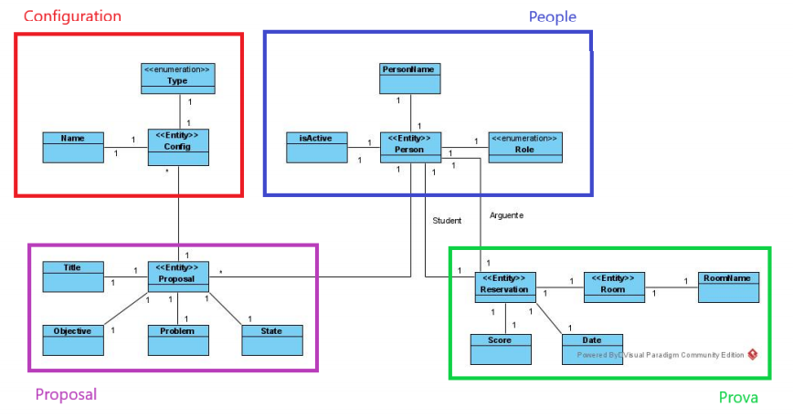
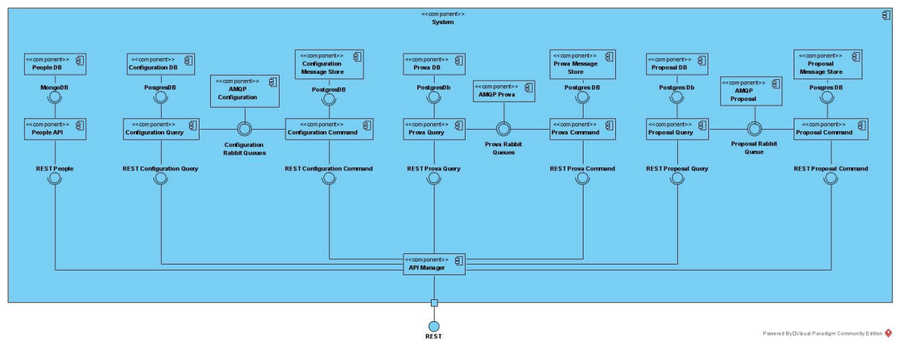

# Project ExamManagement

## Used Technologies, Tools and Notations
    - WSO2 
    - Docker
    - JMeter
    - UML
    - BPM
    - Java (SpringBoot)
    - Node (Nest)
    - RabbitMQ

## Organization

The project was developed over 3 iterations. BPMN contains the project with several BPMN diagrams, complex_types folders used when WSO2 tool didn't have the resources need. Integrator similar to a _Broker_ using once agains WS02 tools. Project3 with multiple APIs.

## Project description (more details avaliable at Relatorio.pdf)

Academic project developed with the support of several technologies, frameworks and tools.

* 1st iteration:
    * Model a business process capable of organizing and facilitating the scheduling and evaluation of exams.
    * Using the modeled processes, it is possible to schedule to obtain information from apis, schedule and notify teachers and students.
* 2nd iteration:
    * Using _Integration Studio_ to model various endpoints according to the needs and resources available, similar to a broker.
    * It obtains information from different places, filters, processes and sends it according to the desired format.
* 3rd iteration:
    * RabbitMQ messaging service is used, which allows inter-microservice communication.
    * The APIs models that were developed: 
    * Database per service.
    * CQRS Pattern.
    * Event sourcing.
    * Messaging MB.
    * Saga and eventual consistency.
    * Itegration testing.
    * Full managed API with WSO2 (API documentation, Roles, Throttling and Analytics)

    

